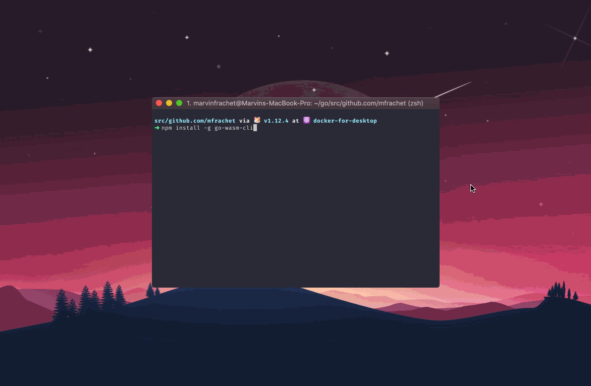

A minimalistic cli to create and run (with hot reload) Go application targeting WASM

<p align="center">

</p>

## Installation

```sh
$ npm i -g go-wasm-cli
```

## Creating an app

```sh
$ go-wasm create my-app
```

## Running the app

```sh
$ cd my-app
$ go-wasm start
```
